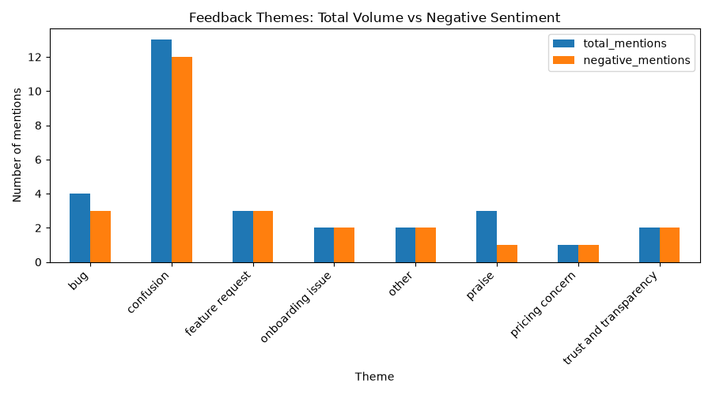

# Customer Feedback Analyzer

An end-to-end pipeline that takes raw customer feedback, classifies it by sentiment and theme using AI, and surfaces which issues are most urgent — turning messy qualitative feedback into a decision-ready priority view for a product team.

Built as a hands-on AIPM portfolio project, applied to real product context: **RapidNative**, an AI-native mobile app builder that turns natural language prompts into React Native apps.

## Why I built this

RapidNative recently ran user-testing sessions that produced a manually-curated P0/P1/P2 priority list (e.g. "improve generation accuracy," "fix mobile preview," "add AI clarifying questions before generation"). That process — reading through feedback and manually tagging what matters most — took real human time and only happens periodically.

This project is a lightweight, repeatable version of that same workflow: instead of manually reading and tagging feedback, an AI pipeline classifies it automatically and generates a prioritized summary in minutes. The goal isn't to replace user-testing sessions, but to make prioritization insight available continuously, from whatever feedback is coming in day to day.

## How it works

**Pipeline: raw feedback → cleaned data → AI classification → prioritized insights**

1. **Data collection** (`data/raw/feedback_raw.csv`) — Feedback entries modeled on real RapidNative user-testing themes (generation accuracy, mobile preview issues, onboarding, transparency, pricing). Labeled `synthetic_sample` in the dataset, since real public review volume for RapidNative (Product Hunt, Reddit) was too sparse to build a meaningful sample from directly.
2. **Cleaning** (`src/clean_data.py`) — Deduplication, empty-value handling, whitespace trimming, date standardization, word-count tagging. Built with pandas.
3. **Classification** (`src/analyze_feedback.py`) — Each feedback entry is classified for:
   - **Sentiment** (positive/negative) using a pretrained Hugging Face sentiment model
   - **Theme** (bug, feature request, confusion, pricing concern, trust/transparency, etc.) using zero-shot classification (`facebook/bart-large-mnli`) — this lets the model sort feedback into custom categories without needing any labeled training data upfront
4. **Insight generation** (`src/generate_insights.py`) — Aggregates raw classifications into:
   - Overall sentiment breakdown
   - Theme volume (what's mentioned most)
   - **Negative-sentiment-by-theme** (what's mentioned most *and* causing the most frustration — the real priority signal, since raw volume alone can be misleading)
   - A bar chart (`output/theme_chart.png`) and text summary (`output/insights_summary.txt`) for at-a-glance sharing

## Key output

See `output/insights_summary.txt` for the full breakdown.

## Known limitation (and why I'm flagging it, not hiding it)

The zero-shot model over-classified feedback into a generic **"confusion"** theme — including comments that were actually bugs or transparency complaints, because they happened to contain words like "don't understand" or "not clear." Zero-shot classification scores text against label wording rather than deeper intent, so it can conflate categories that share surface language.

This wasn't corrected by hand-editing results — instead, it's documented here as a real constraint of the approach. In a next iteration, the fix would be narrowing/renaming ambiguous labels (e.g. splitting "confusion" into "unclear positioning" vs "lacks transparency") and validating against a larger sample. Knowing where an AI classification breaks down, and being able to explain why, matters as much as the pipeline working in the first place.

## Relevance to RapidNative

- **Faster feedback loop**: shrinks the gap between "users are saying X" and "the team notices X is a pattern," instead of relying only on periodic formal testing rounds.
- **Continuous monitoring potential**: the same pipeline could run on real, ongoing feedback sources — support tickets, Discord, in-app feedback, app store/Product Hunt reviews — rather than a one-time synthetic sample.
- **Low-cost and repeatable**: built entirely on free, local, open-source models (Hugging Face) — no per-run API cost, so it can run as often as needed.

## Tech stack

- Python, pandas
- Hugging Face `transformers` (sentiment-analysis + zero-shot-classification pipelines)
- matplotlib
- Google Colab (for local disk-space-constrained runs)

## Project structure
customer-feedback-analyzer/
├── data/
│ ├── raw/feedback_raw.csv # raw synthetic sample (source-labeled)
│ ├── cleaned_feedback.csv # cleaned dataset
│ └── analyzed_feedback.csv # sentiment + theme classified
├── src/
│ ├── clean_data.py
│ ├── analyze_feedback.py
│ └── generate_insights.py
├── output/
│ ├── insights_summary.txt
│ └── theme_chart.png
└── requirements.txt

## Next steps

- Connect to a real, ongoing feedback source instead of a synthetic sample
- Refine theme categories to reduce classification overlap
- Automate as a scheduled weekly/monthly run for continuous monitoring